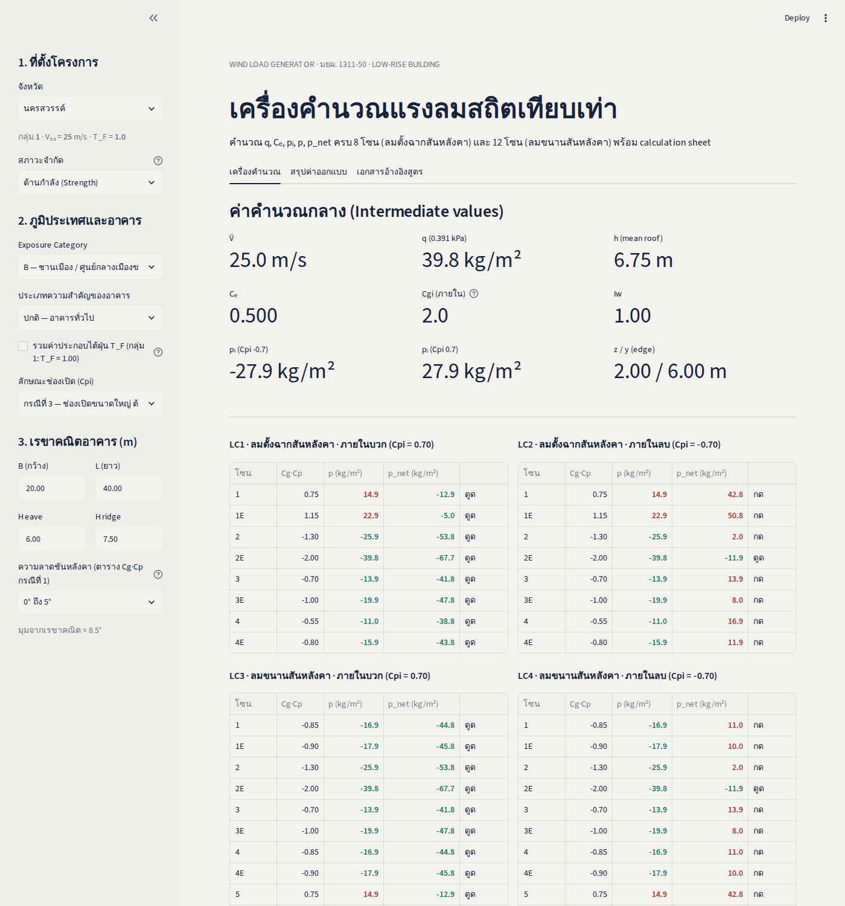
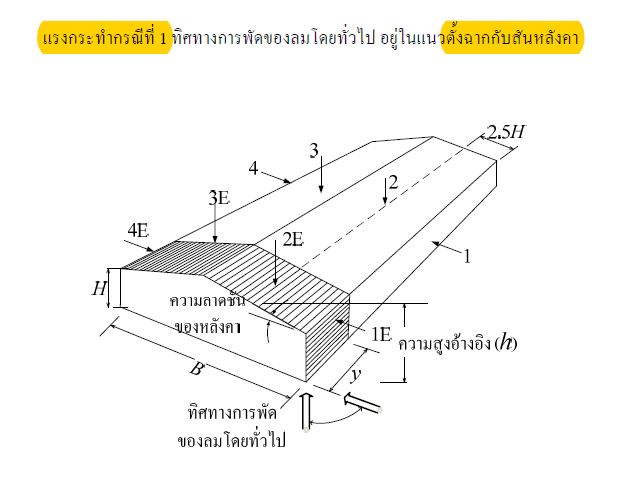
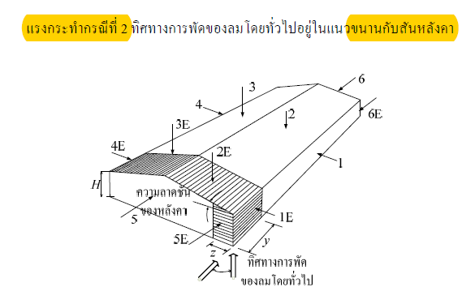

# Wind Load Generator — มยผ. 1311-50

เครื่องคำนวณแรงลมสถิตเทียบเท่า (Static / Envelope Procedure) สำหรับ **อาคารเตี้ย (low-rise building)** ตามมาตรฐาน
**มยผ. 1311-50** (มาตรฐานการคำนวณแรงลมและการตอบสนองของอาคาร กรมโยธาธิการและผังเมือง)

คำนวณ `q`, `Cₑ`, `pᵢ`, `p`, `p_net` ครบ **8 โซน** (ลมตั้งฉากสันหลังคา) และ **12 โซน** (ลมขนานสันหลังคา)
แยกเป็น 4 Load Case (LC1–LC4) พร้อมสรุปค่าวิกฤตและแผ่นแสดงการคำนวณ (calculation sheet)

มีให้ใช้ 3 แบบ ผลคำนวณตรงกัน:

| ไฟล์ | รูปแบบ | ต้องติดตั้ง |
|---|---|---|
| [`streamlit_app.py`](streamlit_app.py) | เว็บแอป Streamlit — deploy ขึ้น Streamlit Community Cloud ได้ | `streamlit`, `pandas` |
| [`index.html`](index.html) | เว็บแอป (React) ไฟล์เดียว เปิดในเบราว์เซอร์ได้ทันที ใช้งานออฟไลน์ได้ | ไม่ต้อง |
| [`wind_load.py`](wind_load.py) | Mini Python — command line / ใช้เป็น library (ตัวคำนวณหลักของ Streamlit ด้วย) | Python 3.8+ (standard library เท่านั้น) |



---

## เริ่มใช้งาน

### Streamlit

รันในเครื่อง:

```bash
pip install -r requirements.txt
streamlit run streamlit_app.py      # เปิด http://localhost:8501
```

Deploy ขึ้น **Streamlit Community Cloud** (ฟรี):

1. Push repo นี้ขึ้น GitHub (ต้องมี `streamlit_app.py`, `wind_load.py`, `requirements.txt`, `docs/` อยู่ใน branch ที่จะ deploy)
2. เข้า <https://share.streamlit.io> → ล็อกอินด้วย GitHub → **Create app** → **Deploy a public app from GitHub**
3. กรอก
   - Repository: `Ninjaa009/WindLoadGenerator_DPT1131-50`
   - Branch: `main` (หรือ branch ที่มีไฟล์)
   - Main file path: `streamlit_app.py`
4. (ไม่บังคับ) ตั้ง App URL เช่น `windload-dpt1311` → กด **Deploy** รอ 1–2 นาที
5. ทุกครั้งที่ push ขึ้น branch นั้น แอปจะอัปเดตเองอัตโนมัติ

ในแอปมี: แถบซ้ายกรอกข้อมูล · แท็บเครื่องคำนวณ (ค่ากลาง, LC1–LC4, calculation sheet, ดาวน์โหลด CSV/TXT)
· แท็บสรุปค่าออกแบบ (ค่าวิกฤตต่อโซนตามทิศลม) · แท็บเอกสารอ้างอิงสูตร
ธีมสีกำหนดใน [`.streamlit/config.toml`](.streamlit/config.toml)

### เว็บแอป

ดับเบิลคลิก `index.html` หรือเปิดผ่าน GitHub Pages มี 3 แท็บ

1. **เครื่องคำนวณ** — กรอกข้อมูล ดูค่ากลาง ตาราง LC1–LC4 และ calculation sheet แทนค่าทีละขั้น
2. **สรุปค่าออกแบบ** — เลือกทิศลม แล้วดูแรงกด/แรงดูดวิกฤตของแต่ละโซน และมาจาก LC ไหน
3. **เอกสารอ้างอิงสูตร** — สูตร ตัวแปร ตาราง และรูปโซน

### Mini Python

```bash
python3 wind_load.py                                   # ค่าเริ่มต้น
python3 wind_load.py --province ภูเก็ต --exposure A --cpi 2 --B 15 --L 30 --H-eave 5 --H-ridge 8
python3 wind_load.py --importance very-high            # อาคารสำคัญสูงมาก (คูณ T_F อัตโนมัติ)
python3 wind_load.py --limit-state serviceability      # ด้านการใช้งาน Iw = 0.75
python3 wind_load.py --json > result.json              # ผลลัพธ์ JSON (หน่วย N/m²)
python3 wind_load.py --list-provinces                  # รายชื่อจังหวัดและกลุ่ม
```

| ออปชัน | ค่า | ค่าเริ่มต้น | ความหมาย |
|---|---|---|---|
| `--province` | ชื่อจังหวัด (ดู `--list-provinces`) | `นครสวรรค์` | กำหนดกลุ่มความเร็วลม V₅₀, T_F |
| `--limit-state` | `strength` / `serviceability` | `strength` | สภาวะจำกัด (เลือกชุด Iw) |
| `--exposure` | `A` / `B` / `C` | `B` | สภาพภูมิประเทศ |
| `--importance` | `low` / `normal` / `high` / `very-high` | `normal` | ประเภทความสำคัญอาคาร |
| `--cpi` | `1` / `2` / `3` | `3` | กรณีช่องเปิด (Cpi) |
| `--tf` / `--no-tf` | — | อัตโนมัติ | บังคับคูณ/ไม่คูณ T_F (ถ้าไม่ระบุ: คูณเมื่อ `very-high`) |
| `--B`, `--L` | m | `20`, `40` | ความกว้าง / ความยาวอาคาร |
| `--H-eave`, `--H-ridge` | m | `6.0`, `7.5` | ความสูงชายคา / สันหลังคา |
| `--roof-slope` | `0-5` / `20` / `30-45` / `90` | `0-5` | bin มุมหลังคาสำหรับตาราง Cg·Cp กรณีที่ 1 |
| `--json` | — | — | พิมพ์ผลเป็น JSON |

ใช้เป็น library:

```python
from wind_load import calculate, report, GRAV

r = calculate(province="ชลบุรี", exposure="A", cpi_case="2", B=18, L=36, H_eave=5, H_ridge=7)
print(report(r))                                  # รายงานแบบข้อความ
for c in r["crit_trans"]:                         # ค่าวิกฤตลมตั้งฉาก
    print(c["zone"], c["pressure"], c["suction"]) # net เป็น N/m² — หาร GRAV เพื่อได้ kg/m²
```

ตัวอย่างผลลัพธ์ (ค่าเริ่มต้น):

```
q = 0.5 × 1.25 × 25.00² = 390.6 N/m² = 39.82 kg/m²
Ce (Exposure B: 0.5*(z/12.7)^0.5) = 0.365 → ใช้ 0.500
z = 2.00 m, y = 6.00 m  (ด้านแคบ = 20.0 m)
pi (Cpi=-0.7) = -27.87 kg/m²,  pi (Cpi=0.7) = 27.87 kg/m²

ค่าวิกฤต — ลมตั้งฉากสันหลังคา (LC1 vs LC2)
  โซน          แรงกดวิกฤต           แรงดูดวิกฤต
  1           +42.8 (LC2)           -12.9 (LC1)
  2E                    —           -67.7 (LC1)
  ...
```

---

## ข้อมูลที่ต้องกรอก

| กลุ่ม | ข้อมูล |
|---|---|
| ที่ตั้งโครงการ | จังหวัด → กลุ่มความเร็วลม, สภาวะจำกัด (กำลัง/ใช้งาน), รวม T_F หรือไม่ |
| ภูมิประเทศและอาคาร | Exposure A/B/C, ประเภทความสำคัญ, ลักษณะช่องเปิด (Cpi) |
| เรขาคณิต (m) | B (กว้าง), L (ยาว), H eave, H ridge, bin มุมหลังคา |

## ขั้นตอนการคำนวณ

### 1. หน่วยแรงลมอ้างอิง q

```
V̄ = V₅₀                (ทั่วไป)
V̄ = T_F · V₅₀          (รวมไต้ฝุ่น — บังคับสำหรับอาคารสำคัญสูงมาก)
q = ½ · ρ · V̄²         ρ = 1.25 kg/m³  → N/m² ÷ 9.81 = kg/m²
```

| กลุ่ม | V₅₀ (m/s) | T_F |
|---|---|---|
| 1 | 25 | 1.0 |
| 2 | 27 | 1.0 |
| 3 | 29 | 1.0 |
| 4A | 25 | 1.2 |
| 4B | 25 | 1.08 |

### 2. ความสูงอ้างอิง h และ Cₑ (หัวข้อ 3.4)

```
θ = atan((H_ridge − H_eave) / (B/2))
h = (H_eave + H_ridge)/2   แต่ไม่น้อยกว่า 6 m
```

| Exposure | สภาพ | สูตร Cₑ | ขอบเขต |
|---|---|---|---|
| A | เมืองใหญ่หนาแน่น / ชายฝั่งคลื่นลมแรง | `(z/10)^0.28` | 1.0 – 2.5 |
| B | ชานเมือง / ศูนย์กลางเมืองขนาดเล็ก | `0.5·(z/12.7)^0.5` | 0.5 – 2.5 |
| C | ศูนย์กลางเมืองใหญ่ ตึกสูงหนาแน่น | `0.4·(z/30)^0.72` | 0.4 – 2.5 |

### 3. ค่าประกอบการกระโชก

`Cg = 2.0` (ภายนอก — รวมอยู่ในตาราง Cg·Cp แล้ว), `Cgi = 2.0` (ภายใน)

### 4. ค่าประกอบความสำคัญ Iw (ตาราง 2-2)

| ประเภท | ตัวอย่าง | Iw ด้านกำลัง | Iw ด้านใช้งาน |
|---|---|---|---|
| น้อย (`low`) | เกษตร / ชั่วคราว | 0.8 | 0.75 |
| ปกติ (`normal`) | อาคารทั่วไป | 1.0 | 0.75 |
| มาก (`high`) | ชุมนุมคน / โรงเรียน | 1.15 | 0.75 |
| สูงมาก (`very-high`) | โรงพยาบาล / สถานีดับเพลิง | 1.15 | 0.75 |

### 5. ระยะโซนขอบ z, y (หัวข้อ 4.1)

```
z = min(0.10·ด้านแคบ, 0.40·h)   แต่ ≥ max(0.04·ด้านแคบ, 1 m)
y = max(6 m, 2z)
```

### 6. หน่วยแรงลมภายใน pᵢ (หัวข้อ 2.6)

```
pᵢ = Iw · q · Cₑ · Cgi · Cpi
```

| กรณี | Cpi | ลักษณะช่องเปิด |
|---|---|---|
| 1 | −0.15 หรือ 0.0 | ช่องเปิดรวม < 0.1% ผิวทั้งหมด |
| 2 | −0.45 หรือ 0.3 | รั่วซึมไม่สม่ำเสมอ ปิดสนิทได้เมื่อมีพายุ |
| 3 | −0.7 หรือ 0.7 | ช่องเปิดขนาดใหญ่ ต้านพายุไม่ได้ |

### 7. หน่วยแรงลมภายนอกและสุทธิ

```
p     = Iw · q · Cₑ · (Cg·Cp)
p_net = p − pᵢ
```

ค่าบวก (+) = **แรงกด** เข้าหาผิว · ค่าลบ (−) = **แรงดูด/ยก** ออกจากผิว

#### กรณีที่ 1 — ลมตั้งฉากสันหลังคา (Transverse)



| มุมหลังคา | 1 | 1E | 2 | 2E | 3 | 3E | 4 | 4E |
|---|---|---|---|---|---|---|---|---|
| 0°–5° | 0.75 | 1.15 | −1.3 | −2.0 | −0.7 | −1.0 | −0.55 | −0.8 |
| 20° | 1.0 | 1.5 | −1.3 | −2.0 | −0.9 | −1.3 | −0.8 | −1.2 |
| 30°–45° | 1.05 | 1.3 | 0.4 | 0.5 | −0.8 | −1.0 | −0.7 | −0.9 |
| 90° | 1.05 | 1.3 | 1.05 | 1.3 | −0.7 | −0.9 | −0.7 | −0.9 |

โซน 1/1E = ผนังต้นลม · 2/2E = หลังคาต้นลม · 3/3E = หลังคาท้ายลม · 4/4E = ผนังท้ายลม

#### กรณีที่ 2 — ลมขนานสันหลังคา (Longitudinal)



| มุม | 1 | 1E | 2 | 2E | 3 | 3E | 4 | 4E | 5 | 5E | 6 | 6E |
|---|---|---|---|---|---|---|---|---|---|---|---|---|
| 0°–90° | −0.85 | −0.9 | −1.3 | −2.0 | −0.7 | −1.0 | −0.85 | −0.9 | 0.75 | 1.15 | −0.55 | −0.8 |

โซน 1–4 (+E) = หลังคา · 5/5E = ผนังต้นลม (endwall) · 6/6E = ผนังท้ายลม (endwall)

## Load Case

| LC | ทิศลม | ความดันภายใน | ตาราง |
|---|---|---|---|
| LC1 | ตั้งฉากสันหลังคา | บวก (Cpi สูง) | กรณีที่ 1 — 8 โซน |
| LC2 | ตั้งฉากสันหลังคา | ลบ (Cpi ต่ำ) | กรณีที่ 1 — 8 โซน |
| LC3 | ขนานสันหลังคา | บวก (Cpi สูง) | กรณีที่ 2 — 12 โซน |
| LC4 | ขนานสันหลังคา | ลบ (Cpi ต่ำ) | กรณีที่ 2 — 12 โซน |

แต่ละ LC คือชุดแรงลมสุทธิพร้อมป้อนลงโปรแกรมวิเคราะห์โครงสร้าง (แยกเป็นคนละ case)
การหาค่าวิกฤตเทียบเฉพาะ 2 LC ของทิศเดียวกัน (LC1 vs LC2, LC3 vs LC4) เพื่อให้แรงทุกโซนยังเกิดพร้อมกันในเฟรมเดียวกัน

## โครงสร้างโปรเจกต์

```
.
├── streamlit_app.py  # เว็บแอป Streamlit (เรียกใช้ wind_load.py)
├── requirements.txt  # dependency สำหรับ Streamlit
├── .streamlit/
│   └── config.toml   # ธีมสี
├── index.html        # เว็บแอปไฟล์เดียว (React + รูปโซนฝังเป็น base64)
├── wind_load.py      # Mini Python: CLI + library ตรรกะเดียวกับเว็บ
├── docs/
│   ├── zone_case1.png          # รูปโซนกรณีลมตั้งฉากสันหลังคา
│   ├── zone_case2.png          # รูปโซนกรณีลมขนานสันหลังคา
│   └── streamlit_screenshot.png
└── README.md
```

## ข้อจำกัด

- ใช้เฉพาะอาคารเตี้ยด้วยวิธีสถิตเทียบเท่า (Envelope / Static Procedure)
- รายชื่อจังหวัดยังไม่ครบทุกจังหวัด — ถ้าไม่มี ให้เลือกจังหวัดในกลุ่มความเร็วลมเดียวกัน
- มุมหลังคาเลือกเป็น bin (0–5°, 20°, 30–45°, 90°) ยังไม่ interpolate ระหว่าง bin
- ยังไม่รวมสมการ 2-8 สำหรับคำนวณ Cgi และตาราง Cₑ สำเร็จรูป

## ข้อสงวน

เครื่องมือช่วยคำนวณเบื้องต้นเท่านั้น ผู้ใช้ต้องตรวจสอบกับมาตรฐาน มยผ. 1311-50 ฉบับจริง
และรับผิดชอบการนำผลไปใช้ออกแบบโดยวิศวกรผู้มีใบอนุญาต
